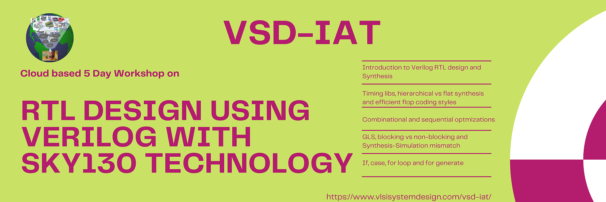
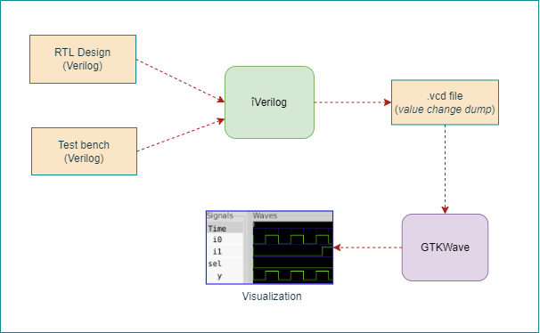
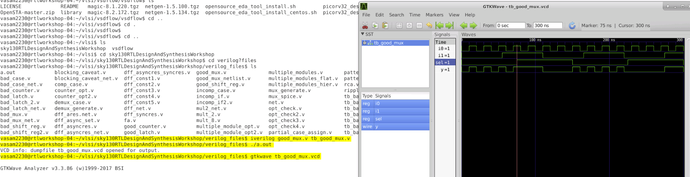
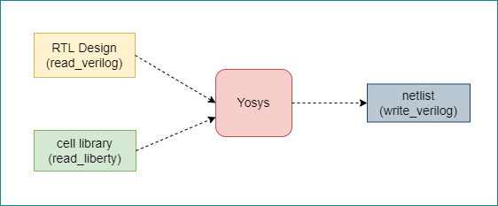
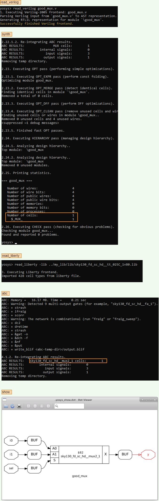

# RTL design using Verilog with SKY130 Technology<!-- omit in toc -->

Table of Contents
- [1. Introduction](#1-introduction)
- [2. Day 1 - Introduction to Verilog RTL design and Synthesis](#2-day-1---introduction-to-verilog-rtl-design-and-synthesis)
  - [2.1. Introduction to Simulation](#21-introduction-to-simulation)
    - [2.1.1. Simulation results](#211-simulation-results)
  - [2.2. Introduction to Synthesis](#22-introduction-to-synthesis)
    - [2.2.1. Some Yosys commands to synthesize an RTL design and generate netlist](#221-some-yosys-commands-to-synthesize-an-rtl-design-and-generate-netlist)
    - [2.2.2. Synthesis results for good_mux.v](#222-synthesis-results-for-good_muxv)

# 1. Introduction
This is a 5-day workshop from VSD-IAT on RTL design and synthesis using open source silicon toolchains involving iVerilog, GTKWave, Yosys and Sky130 PDKs.  
This report is written as a part of final submission to summarize the 5-day journey through the workshop.

# 2. Day 1 - Introduction to Verilog RTL design and Synthesis
## 2.1. Introduction to Simulation
**RTL design**: Register Transfer Level (RTL) is representation of a digital circuit at an abstract level. This abstract realization of a specification is achieved using HDLs like Verilog, VHDL etc in simple text form. Before the invention of RTL, digital engineers used to specify their desgins as schematic entry which could be tedious and error prone.  

**Simulation**: RTL design is checked for adherence to its specification using simulation. This helps finding and fixing bugs in the RTL design in the early stages of design development. iVerilog gives the framework to achieve this.
iVerilog in short to [Icarus Verilog](http://iverilog.icarus.com/) is an open source toolchain for simulation and synthesis. Although it is used only for simulation due to it's potential advantages Yosys brings as a synthesis tool (*more details in later parts*). iVerilog frameowrk requires the RTL desgin file and a test bench file for simulation.  

A test bench file specifies stimulus to the input ports of the RTL design. This way the designer could verify the design for every change at its input ports, the change in the output. 
The simulation output of iVerilog can be taken as a value change dump ('.vcd') file that could then be visualized in GTKWave.  
[GTKWave](http://gtkwave.sourceforge.net/) is an open source tool for visualizing the signal dumps in .vcd/.lxt formats.  

The below two figures illustrates the simulation in iVerilog and post-processing in GTKWave.  
Test bench file performs the below  
&emsp;&emsp;1. Instantiate the RTL design  
&emsp;&emsp;2. Generate stimulus to the design inputs  
&emsp;&emsp;3. To observe stimulus, dump the signals to .vcd file  

Simulation in iVerilog:  
&emsp;&emsp;1. Takes RTL design and Test bench to perform simulation  
&emsp;&emsp;2. Dump simulation signals to a .vcd file  

Post-processing in GTKWave:  
&emsp;&emsp;1. Takes the.vcd file and displays it as a waveform view for analysis.  

### 2.1.1. Simulation results
The workshop provided example RTL design for 1-bit two input mux and it's corresponding test bench file. The design is simulated in iVerilog and the signals are visualised in GTKWave.  

## 2.2. Introduction to Synthesis
**Synthesis**: The RTL design description is translated into gate-level description by a synthesis tool. Very popular Open source synthesis tool [Yosys](http://bygone.clairexen.net/yosys/) is used for synthesis.  
The synthesis tool takes the RTL desgin and the cell library (liberty file) as inputs and translates the RTL into netlist.
Hence the netlist is the gate-level representation of the specifiec logic desgin via Verilog HDL in RTL.  

### 2.2.1. Some Yosys commands to synthesize an RTL design and generate netlist
    # read rtl design 
    read_verilog good_mux.v

    # generic synthesis
    synth -top good_mux

    # read sky130 cell library
    read_liberty -lib ../my_lib/lib/sky130_fd_sc_hd__tt_025C_1v80.lib

    # generate netlist using sky130 cell library
    abc -liberty ../my_lib/lib/sky130_fd_sc_hd__tt_025C_1v80.lib  

**netlist is the translation of RTL design to gate-level design using the standard cells specified in the liberty file.**  

### 2.2.2. Synthesis results for good_mux.v

