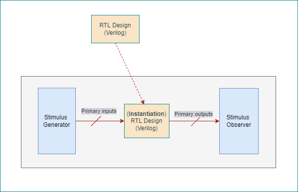

# RTL design using Verilog with SKY130 Technology<!-- omit in toc -->

Table of Contents
- [1. Introduction](#1-introduction)
- [2. Day 1 - Introduction to Verilog RTL design and Synthesis](#2-day-1---introduction-to-verilog-rtl-design-and-synthesis)
  - [2.1. Introduction to Simulation](#21-introduction-to-simulation)
    - [2.1.1. Simulation results](#211-simulation-results)
  - [2.2. Introduction to Synthesis](#22-introduction-to-synthesis)
    - [2.2.1. Yosys synthesizer flow](#221-yosys-synthesizer-flow)
      - [2.2.1.1. Read RTL design](#2211-read-rtl-design)
      - [2.2.1.2. Generic synthesis](#2212-generic-synthesis)
      - [2.2.1.3. Read Sky130 cell library](#2213-read-sky130-cell-library)
      - [2.2.1.4. Generate netlist](#2214-generate-netlist)
      - [2.2.1.5. Show](#2215-show)
- [3. Day 2 - Timing libs, hierarchical vs flat synthesis and efficient flop coding styles](#3-day-2---timing-libs-hierarchical-vs-flat-synthesis-and-efficient-flop-coding-styles)
  - [3.1. Timing libs](#31-timing-libs)
    - [3.1.1. Sky130 Process Node](#311-sky130-process-node)
    - [3.1.2. Introduction to standard cell library](#312-introduction-to-standard-cell-library)
  - [3.2. Hierarchial synthesis vs Flat synthesis](#32-hierarchial-synthesis-vs-flat-synthesis)
    - [3.2.1. Hierarchial synthesis](#321-hierarchial-synthesis)
    - [3.2.2. Flat synthesis](#322-flat-synthesis)

# 1. Introduction
This is a 5-day workshop from VSD-IAT on RTL design and synthesis using open source silicon toolchains involving iVerilog, GTKWave, Yosys with Sky130 technology.  
This report is written as a part of final submission to summarize the 5-day journey through the workshop.

# 2. Day 1 - Introduction to Verilog RTL design and Synthesis
## 2.1. Introduction to Simulation
**RTL design**: Register Transfer Level (RTL) is representation of a digital circuit at an abstract level. This abstract realization of a specification is achieved using HDLs like Verilog, VHDL etc in simple text form. Before the invention of RTL, digital engineers used to specify their desgins as schematic entry which could be tedious and error prone.  

**Simulation**: RTL design is checked for adherence to its specification using simulation. This helps finding and fixing bugs in the RTL design in the early stages of design development. iVerilog gives the framework to achieve this.
iVerilog in short to [Icarus Verilog](http://iverilog.icarus.com/) is an open source toolchain for simulation and synthesis. Although it is used only for simulation due to it's potential advantages Yosys brings as a synthesis tool (*more details in later parts*). iVerilog frameowrk requires the RTL desgin file and a test bench file for simulation.  

A test bench file specifies stimulus to the input ports of the RTL design. This way the designer could verify the design for every change at its input ports, the change in the output. 
The simulation output of iVerilog can be taken as a value change dump ('.vcd') file that could then be visualized in GTKWave.  
[GTKWave](http://gtkwave.sourceforge.net/) is an open source tool for visualizing the signal dumps in .vcd/.lxt formats.  

The below two figures illustrates the simulation in iVerilog and post-processing in GTKWave.  
Test bench file performs the below  
&emsp;&emsp;1. Instantiate the RTL design  
&emsp;&emsp;2. Generate stimulus to the design inputs  
&emsp;&emsp;3. To observe stimulus, dump the signals to .vcd file  

Simulation in iVerilog:  
&emsp;&emsp;1. Takes RTL design and Test bench to perform simulation  
&emsp;&emsp;2. Dump simulation signals to a .vcd file  

Post-processing in GTKWave:  
&emsp;&emsp;1. Takes the.vcd file and displays it as a waveform view for analysis.  

### 2.1.1. Simulation results
The workshop provided example RTL design for 1-bit two input mux ('good_mux.v') and it's corresponding test bench file. The design is simulated in iVerilog and the signals are visualised in GTKWave.  

## 2.2. Introduction to Synthesis
**Synthesis**: The RTL design description is translated into gate-level description by a synthesis tool. Very popular Open source synthesis tool [Yosys](http://bygone.clairexen.net/yosys/) is used for synthesis.  
The synthesis tool takes the RTL desgin and the cell library (liberty file) as inputs and translates the RTL into netlist.
Hence the netlist is the gate-level representation of the specifiec logic desgin via Verilog HDL in RTL.  

### 2.2.1. Yosys synthesizer flow

#### 2.2.1.1. Read RTL design
read_verilog: This command loads modules from a Verilog file to the current design[].  

#### 2.2.1.2. Generic synthesis
synth[options]: This command runs the default synthesis script. This command does not operate on partly selected designs[].  
&emsp;-top <module>: use the specified module as top module (default='top')  
  

#### 2.2.1.3. Read Sky130 cell library
read_liberty[options]: This command reads cells from liberty file as modules into current design[].  
&emsp;-lib: only create empty blackbox modules  

#### 2.2.1.4. Generate netlist
abc[options]: This pass uses the ABC tool [1] for technology mapping of yosys's internal gate library to a target architecture[].  
&emsp;-liberty <file>: generate netlists for the specified cell library (using the liberty file format).  
&emsp;In our case 'sky130_fd_sc_hd__tt_025C_1v80.lib'.  
*Note: When no target cell library is specified the Yosys standard cell library is loaded into ABC before the ABC script is executed.*  
  

#### 2.2.1.5. Show
Create a graphviz DOT file for the selected part of the design and compile it to a graphics file (usually SVG or PostScript)[].  

# 3. Day 2 - Timing libs, hierarchical vs flat synthesis and efficient flop coding styles
## 3.1. Timing libs
### 3.1.1. Sky130 Process Node
The SKY130 is a mature 180nm-130nm hybrid technology originally developed internally by Cypress Semiconductor before being spun out into SkyWater Technology and made accessible to general industry. SkyWater and Google’s collaboration is now making this technology accessible to everyone! [source: https://github.com/google/skywater-pdk]  
### 3.1.2. Introduction to standard cell library
As a part of SkyWater Open Source PDK, [multiple](https://skywater-pdk.readthedocs.io/en/main/contents/libraries/foundry-provided.html) standard digital cell libraries are provided that cover a range of different use cases [source: https://github.com/google/skywater-pdk].  
In this workshop we will be using sky130_fd_sc_hd (high density) standard cell library to map our synthesized design with.  

## 3.2. Hierarchial synthesis vs Flat synthesis
### 3.2.1. Hierarchial synthesis
In hierarchial synthesis the hierarchy of the RTL design is preserved through the final netlist. Let us look at the below RTL design where we have two sub modules, both instantiated by a top modules.  

Generic synthesis preserves the hierarchy. It can also be seen that the cells are not mapped to sky130 specific technology yet.  

abc tool maps the technology to Sky130 and generates the netlist. It can be seen that the hierarchy is still preserved.  

It is quite interesting to see how tool itself goes through optimization. RTL mutiple modules.v when synthesized with two different versions of yosys- 07 and 0.9 versions.  
The optimization at the technology mapping of sub_modules2.  
Also quite intesting how yosys decided on two different flavors of and2 for sub_module1 in these versions.    

Details of the realized standard sky130 cells in this design can be found from Skywater PDK documentation.  
[2-input AND](https://antmicro-skywater-pdk-docs.readthedocs.io/en/test-submodules-in-rtd/contents/libraries/sky130_fd_sc_hd/cells/and2/README.html)  
[Input isolation, noninverted sleep](https://antmicro-skywater-pdk-docs.readthedocs.io/en/test-submodules-in-rtd/contents/libraries/sky130_fd_sc_hd/cells/lpflow_inputiso1p/README.html)  

### 3.2.2. Flat synthesis

Note: Some Yosys commands
    # read rtl design 
    read_verilog good_mux.v

    # generic synthesis
    synth -top good_mux

    # read sky130 cell library
    read_liberty -lib ../my_lib/lib/sky130_fd_sc_hd__tt_025C_1v80.lib

    # generate netlist using sky130 cell library
    abc -liberty ../my_lib/lib/sky130_fd_sc_hd__tt_025C_1v80.lib  

**netlist is the translation of RTL design to gate-level design using the standard cells specified in the liberty file.**  
