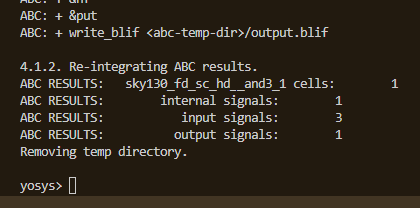
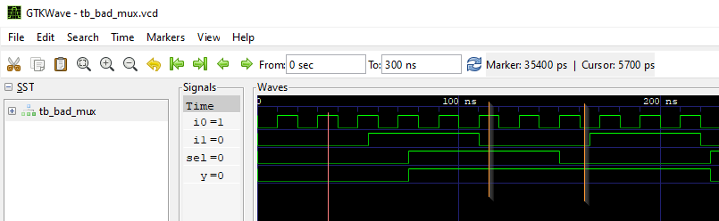
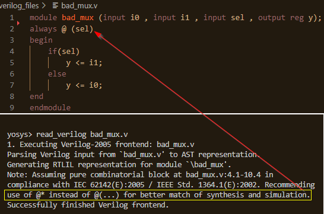
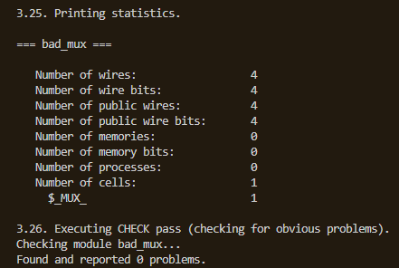
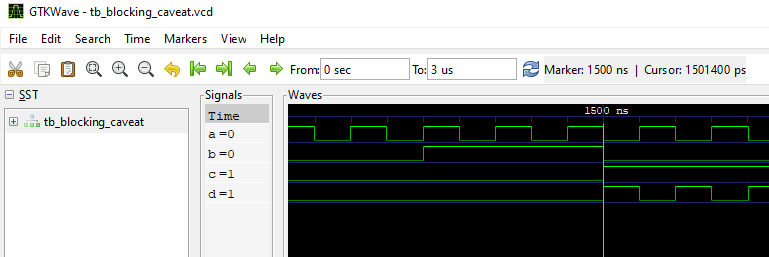

# RTL design using Verilog with SKY130 Technology<!-- omit in toc -->

Table of Contents
- [1. Introduction](#1-introduction)
- [2. Day 1 - Introduction to Verilog RTL design and Synthesis](#2-day-1---introduction-to-verilog-rtl-design-and-synthesis)
  - [2.1. Introduction to Simulation](#21-introduction-to-simulation)
    - [2.1.1. Simulation results](#211-simulation-results)
  - [2.2. Introduction to Synthesis](#22-introduction-to-synthesis)
    - [2.2.1. Yosys synthesizer flow](#221-yosys-synthesizer-flow)
      - [2.2.1.1. Read RTL design](#2211-read-rtl-design)
      - [2.2.1.2. Generic synthesis](#2212-generic-synthesis)
      - [2.2.1.3. Read Sky130 cell library](#2213-read-sky130-cell-library)
      - [2.2.1.4. Generate netlist](#2214-generate-netlist)
      - [2.2.1.5. Show](#2215-show)
- [3. Day 2 - Timing libs, hierarchical vs flat synthesis and efficient flop coding styles](#3-day-2---timing-libs-hierarchical-vs-flat-synthesis-and-efficient-flop-coding-styles)
  - [3.1. Timing libs](#31-timing-libs)
    - [3.1.1. Sky130 Process Node](#311-sky130-process-node)
    - [3.1.2. Introduction to standard cell library](#312-introduction-to-standard-cell-library)
  - [3.2. Hierarchial synthesis vs Flat synthesis](#32-hierarchial-synthesis-vs-flat-synthesis)
    - [3.2.1. Hierarchial synthesis](#321-hierarchial-synthesis)
    - [3.2.2. Selective sub-module level synthesis](#322-selective-sub-module-level-synthesis)
    - [3.2.3. Flat synthesis](#323-flat-synthesis)
  - [3.3. Various Flop coding styles and optimization](#33-various-flop-coding-styles-and-optimization)
    - [3.3.1. Optimizations](#331-optimizations)
- [4. Day 3 - Combinational and Sequential optimizations](#4-day-3---combinational-and-sequential-optimizations)
  - [4.1. Logic optimizations](#41-logic-optimizations)
    - [4.1.1. Combinational logic optimizations](#411-combinational-logic-optimizations)
      - [4.1.1.1. Constant propogation](#4111-constant-propogation)
      - [4.1.1.2. Boolean logic optimization](#4112-boolean-logic-optimization)
    - [4.1.2. Sequential logic optimizations](#412-sequential-logic-optimizations)
      - [4.1.2.1. Constant propogation](#4121-constant-propogation)
  - [4.2. Logic optimizations in Yosys](#42-logic-optimizations-in-yosys)
    - [4.2.1. Combinationals optimization design example 1](#421-combinationals-optimization-design-example-1)
    - [4.2.2. Sequential optimization design example 2](#422-sequential-optimization-design-example-2)
    - [4.2.3. Sequential optimization design example 3](#423-sequential-optimization-design-example-3)
- [5. Day 4 - GLS, blocking vs non-blocking and Synthesis-Simulation mismatch](#5-day-4---gls-blocking-vs-non-blocking-and-synthesis-simulation-mismatch)
  - [5.1. GLS: Synthesis - Simulation Mismatch](#51-gls-synthesis---simulation-mismatch)
    - [5.1.1. Missing sensitivity list](#511-missing-sensitivity-list)
    - [5.1.2. Gate Level Simulation](#512-gate-level-simulation)
    - [5.1.3. Blocking vs Non-blocking assignments](#513-blocking-vs-non-blocking-assignments)
- [6. Day 5 - Verilog: if, case, for loop and for generate](#6-day-5---verilog-if-case-for-loop-and-for-generate)
  - [6.1. Procedural if statement](#61-procedural-if-statement)
  - [6.2. Procedural case statement](#62-procedural-case-statement)
    - [6.2.1. Consolidation](#621-consolidation)
- [7. Note of thanks](#7-note-of-thanks)
- [8. Bibliography](#8-bibliography)

# 1. Introduction
This is a report on a 5-day workshop from VSD-IAT on RTL design and synthesis using open source silicon tools involving iVerilog, GTKWave, Yosys with Sky130 technology.  

# 2. Day 1 - Introduction to Verilog RTL design and Synthesis
## 2.1. Introduction to Simulation
**RTL design**: Register Transfer Level (RTL) is representation of a digital circuit at an abstract level. This abstract realization of a specification is achieved using HDLs like Verilog, VHDL etc in simple text form. Before the invention of RTL, digital engineers used to specify their desgins as schematic entry which could be tedious and error prone.  

**Simulation**: RTL design is checked for adherence to its specification using simulation. This helps finding and fixing bugs in the RTL design in the early stages of design development. iVerilog gives the framework to achieve this.
iVerilog in short to Icarus Verilog [1] is an open source toolchain for simulation and synthesis. Although it is used only for simulation due to it's potential advantages Yosys brings as a synthesis tool (*more details in later parts*). iVerilog frameowrk requires the RTL desgin file and a test bench file for simulation.  
Note: Simulation in iVerilog means Synthesiszing the test bench!  

A test bench file specifies stimulus to the input ports of the RTL design. This way the designer could verify the design for every change at its input ports, the change in the output. 
The simulation output of iVerilog can be taken as a value change dump ('.vcd') file that could then be visualized in GTKWave [2].  
GTKWave is an open source tool for visualizing the signal dumps in .vcd/.lxt formats.  

The below two figures illustrates the simulation in iVerilog and post-processing in GTKWave.  
Test bench file performs the below  
&emsp;&emsp;1. Instantiate the RTL design  
&emsp;&emsp;2. Generate stimulus to the design inputs  
&emsp;&emsp;3. To observe stimulus, dump the signals to .vcd file  

Simulation in iVerilog:  
&emsp;&emsp;1. Takes RTL design and Test bench to perform simulation  
&emsp;&emsp;2. Dump simulation signals to a .vcd file  

Post-processing in GTKWave:  
&emsp;&emsp;1. Takes the.vcd file and displays it as a waveform view for analysis.  

### 2.1.1. Simulation results
The workshop provided example RTL design for 1-bit two input mux ('good_mux.v') and it's corresponding test bench file. The design is simulated in iVerilog and the signals are visualised in GTKWave.  

## 2.2. Introduction to Synthesis
**Synthesis**: The RTL design description is translated into gate-level description by a synthesis tool. Very popular Open source synthesis tool Yosys [3] is used for synthesis.  
The synthesis tool takes the RTL desgin and the cell library (liberty file) as inputs and translates the RTL into netlist.
Hence the netlist is the gate-level representation of the specifiec logic desgin via Verilog HDL in RTL.  

### 2.2.1. Yosys synthesizer flow

#### 2.2.1.1. Read RTL design
read_verilog: This command loads modules from a Verilog file to the current design[].  

#### 2.2.1.2. Generic synthesis
synth[options]: This command runs the default synthesis script. This command does not operate on partly selected designs[].  
&emsp;-top <module>: use the specified module as top module (default='top')  
  

#### 2.2.1.3. Read Sky130 cell library
read_liberty[options]: This command reads cells from liberty file as modules into current design[].  
&emsp;-lib: only create empty blackbox modules  

#### 2.2.1.4. Generate netlist
abc[options]: This pass uses the ABC tool [4] for technology mapping of yosys's internal gate library to a target architecture[].  
&emsp;-liberty <file>: generate netlists for the specified cell library (using the liberty file format).  
&emsp;In our case 'sky130_fd_sc_hd__tt_025C_1v80.lib'.  
*Note: When no target cell library is specified the Yosys standard cell library is loaded into ABC before the ABC script is executed.*  
  

#### 2.2.1.5. Show
Create a graphviz DOT file for the selected part of the design and compile it to a graphics file (usually SVG or PostScript)[].  

# 3. Day 2 - Timing libs, hierarchical vs flat synthesis and efficient flop coding styles
## 3.1. Timing libs
### 3.1.1. Sky130 Process Node
The SKY130 is a mature 180nm-130nm hybrid technology originally developed internally by Cypress Semiconductor before being spun out into SkyWater Technology and made accessible to general industry. SkyWater and Google’s collaboration is now making this technology accessible to everyone! [5]  
### 3.1.2. Introduction to standard cell library
On the gate-level the target architecture is usually described by a “Liberty file”. The Liberty file format is an industry standard format that can be used to describe the behaviour and other properties of standard library cells. [6]  
As a part of SkyWater Open Source PDK, multiple [7] standard digital cell libraries are provided that cover a range of different target architectures [5].  
In this workshop we will be using sky130_fd_sc_hd (high density) standard cell library (target architecture) to map our synthesized design from Yosys.  
Some trivial details of our Liberty file are shown below. Although a thorough look into it has to be given to understand its potenetial.  
  
Also let us have a look at some of the variants of 2-input AND cells from the Liberty library.  
Different variants of and2 with specific cell descriptions can be seen.  
  
[sky130_fd_sc_hd__and2](https://antmicro-skywater-pdk-docs.readthedocs.io/en/test-submodules-in-rtd/contents/libraries/sky130_fd_sc_hd/cells/and2/README.html)  

## 3.2. Hierarchial synthesis vs Flat synthesis
### 3.2.1. Hierarchial synthesis
In hierarchial synthesis the hierarchy of the RTL design is preserved through the final netlist. Let us look at the below RTL design where we have two sub modules, both instantiated by a top modules.  

Generic synthesis preserves the hierarchy. It can also be seen that the cells are not mapped to sky130 specific technology yet.  

abc tool maps the technology to Sky130 and generates the netlist. It can be seen that the hierarchy is still preserved.  

It is quite interesting to see how tool itself goes through optimization. RTL mutiple modules.v when synthesized with two different versions of yosys- 07 and 0.9 versions.  
The optimization at the technology mapping of sub_modules2.  
Also quite intesting how yosys decided on two different flavors of and2 for sub_module1 in these versions.    

Details of the realized standard sky130 cells in this design can be found from Skywater PDK documentation.  
[2-input AND](https://antmicro-skywater-pdk-docs.readthedocs.io/en/test-submodules-in-rtd/contents/libraries/sky130_fd_sc_hd/cells/and2/README.html)  
[Input isolation, noninverted sleep](https://antmicro-skywater-pdk-docs.readthedocs.io/en/test-submodules-in-rtd/contents/libraries/sky130_fd_sc_hd/cells/lpflow_inputiso1p/README.html)  

### 3.2.2. Selective sub-module level synthesis
Just like synthesizing an RTL design at the top mudule level, it can be synthesized at the sub-module level as well. This level of freedom brings the below advantsges.  
* &emsp;  Multiple instantions: In case of having multiple instantiations in our design, this feature helps to synthesize just one instance and use it iteratively throughout the top level.    
* &emsp;  Massive desgins: In case of massive design, sub-module level synthesis reduces the burden on sythesis tool in-terms of performance and time.  
 
We can take a look at the same example of multiple_modules.v.  Let us synthesize only sub_module1 and see how the final netlist appears.  
We can see that the synth command just looks at the specified sub_module1 alone and sub_module2 is ommitted from synthesis.  
  

The generated synthesis output this time gives only the AND gate for the sub_module1 rtl.  
  

The graphical view clearly indicates the netist for synthesized sub_module1.  
  

### 3.2.3. Flat synthesis
yosys command flatten :"This pass flattens the design by replacing cells by their implementation. This pass is very similar to the 'techmap' pass. The only difference is that this pass is using the current design as mapping library.  
Cells and/or modules with the 'keep_hierarchy' attribute set will not be flattened by this command." [source: http://yosyshq.net/yosys/cmd_flatten.html]  

As the name suggestes this pass flattens out the design and hence the hierarchy is lost.  
Let us observe the impact of 'flatten' on systhesized output of same RTL design- multiple_modules.v.  
  

We can see that the submodules were deleted and hierarchy is no longer preserved.  
Please pay attantion to the interesting netlist generated.  
  

Graphical view of flattened netlist is hown below.  
  

## 3.3. Various Flop coding styles and optimization
abc tool maps only the combinational logic cells from the liberty. It doesn't look for the register cells.  
If the RTL design has sequential logic, dfflibmap pass has to be executed before abc pass. dfflibmap pass looks for the register cells in the Liberty and maps to the sequential logic from the synthesis. And then abc pass has to used to complete the mepping for combinatorial logic.  
  
  
Without dfflibmap pass if abc pass is executed, and if the design has only registers, abc has nothing to map and warns like below.  
  
First the register cells must be mapped to the registers that are available on the target architectures. The 
target architecture might not provide all variations of d-type flip-flops with positive and negative clock
edge, high-active and low-active asynchronous set and/or reset, etc. Therefore the process of mapping the
registers might add additional inverters to the design and thus it is important to map the register cells
first. [8]  

Let us try to understand this with an example RTL design- 'dff_asyncres.v'.  
Let us run synth -top on the design and take a look how it looks. We can see that it just represet a d-flip flop.  
  
Let us run dfflibmap -liberty pass on this design and see how it looks. dfflibmap mapped a variant of d-flip flop to our design and this led to an additional inverter in the design.  
  
Now abc -liberty pass has to be run to complete the mapping of combination logic (the inverter cell). This comepletes the mapping.  
  

### 3.3.1. Optimizations
By this time we have already noticed that our behavioural description (RTL design) goes through optimizations. As an example from our previously discussed design- multiple_modules.v, the sub_module2 which synthesized to be an OR gate but ended up being somethig diffrent. It has been mapped to a cell- 'sky130_fd_sc_hd__lpflow_inputiso1p_1' by Yosys from the Liberty. These optimizations are performed by the synthesis tool minimizing area, power consumption etc. in perspective.  
  

# 4. Day 3 - Combinational and Sequential optimizations
## 4.1. Logic optimizations
There following types of logic optimizations are some of the optimization techniques were discussed.
* Combination logic optimizations
  * &emsp; Constant propogation 
    * Direct optimization 
  * &emsp; Boolean logic optimization
    * Karnaugh Map
    * Quine McKluskey

* Sequrntioal logic optimizations
  * &emsp; Constant propogation  
  * &emsp; Advanced optimizations [Not covered in labs]
    * State optimization
    * Retiming
    * Sequential logic cloning (Floorplan aware synthesis)  
### 4.1.1. Combinational logic optimizations
#### 4.1.1.1. Constant propogation
Constant Propagation is an optimization technique employed by synthesis tools to minimize hardware implementation. [source: https://www.fullchipdesign.com/verilog_synthesis_logic_digital_hardware.htm]  
A very nice example for constant propogation optimization is shown [here](https://www.fullchipdesign.com/verilog_synthesis_logic_digital_hardware.htm) [9] where the author points out verilog parameters a nice example of constant propogation optimization. In the below example the author mentions that when the parameter ENABLE == 0, the complete // logic part gets optimized out by the synthesis tool and thus minimizing the hardware realized.  

    module DUT (
        in1, in2, out1, out2);
        // parameter declaration
        parameter ENABLE = 0;
        // ports
        input in1, in2;
        output out1, out2;
        // wires
        wire w_gate1, w_gate2;

        // logic

        assign w_gate1 = (ENABLE == 1) ? in1 : 1'b0;
        assign w_gate2 = (ENABLE == 1) ? in2 : 1'b0;

        assign out1 = w_gate1 & w_gate2;
        assign out2 = w_gate1 ^ w_gate2;
    endmodule

#### 4.1.1.2. Boolean logic optimization

### 4.1.2. Sequential logic optimizations
#### 4.1.2.1. Constant propogation
The below sequential circuit discussed in the lectures, is a nice example where the synthesis tool gets to optomize it out. As the d-input is always 1'b0, irrespective of whether the Reset line is asserted or not, the output of the flip-flop always remains 0. This simplifying the circuit ot the boolean expression,
    (~(A.0)) => (~A)+(~0) => ~A+1 => 1    
Hence the whole logic gets to be replaced by a contant 1.  
  

## 4.2. Logic optimizations in Yosys
Let us take a look at example designs- 'opt_check3.v' for combinatorial logic and 'dff_const1.v' for sequential logic designs.  
### 4.2.1. Combinationals optimization design example 1
'opt_check3.v'  
  
schematic arrived from RTL should look as below:  
  
When this design passes through the sysnthesis tool, it undergoes optimizations from area and power consumption perspective. Although it has to be noted that the beauty of optimization shall not be easily evident with simple designs (like the one we are discussing). This should more evident and appreciating if we are synthesising multiple verilog files representing a CPU architecture.  

It can be seen that Yosys optimized it to an ANDNOT and NOT gates.  
  
  

abc pass find the right combinations logic cell from the Liberty to map it to the synthesized logic.  
  
  

Also we learned about a Yosys command: 

    opt_clean -purge  

This command cleans the design by removing any unused wires and cells. It is usefull to call this after the design as gone through all the passes that do the actual work. In the below counter example, we can see the usefulness of this pass. Due to extremely simplistic design that we are working on, we might not be able to appreciate its use. Nevertheless in complex designs this will be very useful.  
before opt_clean  
  
after opt_clean  
  

### 4.2.2. Sequential optimization design example 2
In this example design- 'dff_const2.v', a asynchronous reset d-type flip flop is used. The data input is always tied to 1. The positive edge reset asserts the output. Let us see how he synthesiszer tries to realize it.  
  

passing through synthesiszer, dfflibmap and abd, gives us the below logical circuit relaization. We can see that there is no flip-flop anymore. It has been optimized by the synthesiszer as there is no need for it. Irrespective of reset state, the output always remains at 1'b1.    
  

### 4.2.3. Sequential optimization design example 3
In the below example design- 'dff_const1.v', unlike above, posedge reset deasserts the output. The input data line is always connected to 1'b1. Let us see how he synthesiszer tries to realize it.  
  

running synth -top  
  
  

dfflibmap -liberty ..  
We can see we just have a flip-flop mapped to our logic.  
  

More importantly we need to run abc pass to map the architecture specific cell to our logic. As we already understood, this step can bring extra combinational logic to our design as there may be all the flavours of target realizable registers available.  
  
  

We can see that the flip-flop stays and has not been removed in optimization which is correct.  

# 5. Day 4 - GLS, blocking vs non-blocking and Synthesis-Simulation mismatch
## 5.1. GLS: Synthesis - Simulation Mismatch
Synthesis - Simulation mismatch arises due to the following reasons.  
* &emsp;Missing sensitivity list
* &emsp;Blocking vs Non-blocking assignments
* &emsp;Non standard verilog coding

### 5.1.1. Missing sensitivity list
In the following example design- 'bad_mux.v'. From the rtl design we wanted to have 2-1 MUX. But from simuation we can clearly see that it is acting like a latch.  
  
This can be an example for missing sensitivity list and also non-standard verilog coding.  
To understand this let us try to synthesisze this design and see if Yosys has anything to say about it.  
  
Clearly the synthesiser warns us about a possible latch in the design. These kind of warnings have to be taken very seriosly and fixed at the earliest possible phase of the design. Letting out such bugs lead to serious implications once the system starts to grow and in the further phase of the system development.  
Assuming that this warning is unfortunately ignored and we proceed with the further steps to synthesis the design.  Lets us see what happens.  
Surprisingly, the synthesiszer synthesises the design as we expected but not what we specified. This is already a Simulation- Synthesis mismatch.  
  
  
  

Lets us write the netlist and perform GLS.
Before we actually look at GLS output, let us see what GLS is.  
### 5.1.2. Gate Level Simulation
GLS stands for **Gate Level Simulation**. Till now we have been doing simulation on our RTL design which helped us to verify the behaviour/funtion of our logic. On similar grounds GLS helps us perform behavioral/functonal verification of our synthesized design.  
GLS is a very important phase of system development as it helps t fix design errors quite early.  
The follwoing iverilog commnds helps to perfom GLS.  
    
    iverilog ../my_lib/verilog_model/primitives.v ../my_lib/verilog_model/sky130_fd_sc_hd.v bad_mux_net.v tb_bad_mux.v
    ./a.out
    gtkwave tb_bad_mux.vcd

  
It can clearly be seen that synthesis realises the logic as we expected but not as we specified. There is a clear and significant distiction between our simulation results and our synthesis results. **This is Simulation - Synthesis Mismatch, which needs to be avoided at all costs.**  

### 5.1.3. Blocking vs Non-blocking assignments
Blocking vs Non-blocking assignments also cause simulation-synthesis mismatch. Blocking vs Non-blocking assignment statements are used in 'always' blocks and special care needs to be take when using them. The main reason to use either Blocking or Nonblocking assignments is to generate either combinational or sequential logic[10].  

    a = in[0];
    b = a;
    c = 1;  

They are blocking assignments. The second line is only allowed to be executed after the first one is complete. In verilog, the logic can be specified to be executed concurrently unlike in common programming languages like C where one instruction exceutes after the other sequentially. Non-blocking assignment statements support us to specify concurrent executable logic.  

     a <= in[0];
     b <= a;
     c <= 1;  

Let us investigate this example design- 'blocking_caveat.v'.  
  
It can be seen that blocking assignemnt statements have been used inside always block for a combinational logic.  
Let us run the simulation and see the results.  
  
It can clearly be seen at the indicated timestamp that the output is latched to the past value of (x = a|b) is getting ANDed with the current value of input c. This is clear indication of a latch inferred in the design. This is clearly not what we wanted to design. Inferred latches unless expected (for example, a basic counter) are not to avoided in a design.  

Let us now run the synthesis and see what happens.  
  
We can clearly see that the synthesis tool realized our logic as we expected but not as we specified. This is clearly a Simulation-Synthesis Mismatch.  

Note:  
It can be seen that the synthesizer doesn't complain about inferred latches. If we clear that our design does not need OR should not have inferred latches, this compiler switch shall be of help.  

    read_verilog -nolatches 

Yosys documentation[3] says:  
    -nolatches
        usually latches are synthesized into logic loops
        this option prohibits this and sets the output to 'x'
        in what would be the latches hold condition

        this behavior can also be achieved by setting the
        'nolatches' attribute on the respective module or
        always block.

Let us just try to impose this and see the outcome.  
The synthesis output does not have any logic cells due to the presence of an inferred latch in the design.  
  
This is a way of controlling the synthesis and debugging your design.  

# 6. Day 5 - Verilog: if, case, for loop and for generate
## 6.1. Procedural if statement
if statement is equivalent to using a continuous assignment with a conditional operator,  
    assign out = (condition) ? a : b;  

However, the procedural if provides new ways to make mistakes.  

    always @(*) begin  
    if (condition) begin  
        out = x;  
    end  
    else begin  
        out = y;  
    end  
end  
This circuit is combinational only if 'out' is always assigned. Otherwise it leads to inferred latches in the design[11].  

## 6.2. Procedural case statement
Case statements in Verilog are nearly equivalent to a sequence of if-elseif-else that compares one expression to a list of others. Its syntax and functionality differs from the switch statement in C. Case statements are more convenient than if statements if there are a large number of cases.[11]  

One has to be careful about **partial assignments** in case statements though.  
  
Due to partial assignment in case 2'b11, it laeds to an inferred latch in the design. Output y2 is latched to whatever the previous value it used to have (either i1, i2, or i3 based on the case that appeared before). Unless intended, this has to avoided.   
In the below example design of another 'bad_case.v', we have a contention with 3rd and 4th statements.  
  
When sel[1] gets asserted, both the last two cases gets executed. Unless intended, this has to avoided.   

### 6.2.1. Consolidation 
One has to be very careful in writng the behavioral specification in verilog. Not following the coding/scripting guidelines will have serious implications. Always the design has to be properly simulated and tested for its desired output. The synthesiser should not be taken for granted. Its potentail has to be explored and to be made use of. As discussed GLS simulation has to be performed and the results have to be verified against the RTL design simulation results.  

# 7. Note of thanks
I would like to extend my sincere thanks to the entire team at VSD for organising this workshop. As well I would like to extend my sincere thanks and appreciation to Mr. Shon Taware for his relenetless support. I would like to wish the entire VSD team and fellow participants from the workshop all the best.  

# 8. Bibliography
[1] Icarus Verilog:     http://iverilog.icarus.com/  
[2] GTKWave:            http://gtkwave.sourceforge.net/  
[3] Yosys:              http://bygone.clairexen.net/yosys/  
[4] ABC tool:           http://people.eecs.berkeley.edu/~alanmi/abc/  
[5] Skywater-PDK:       https://github.com/google/skywater-pdk  
[6] The Liberty Library Modeling Standard: http://www.opensourceliberty.org/  
[7] Target architectures: https://skywater-pdk.readthedocs.io/en/main/contents/libraries/foundry-provided.html  
[8] Yosys manual: https://raw.githubusercontent.com/wiki/jospicant/IceStudio/yosys_manual.pdf  
[9] https://www.fullchipdesign.com/verilog_synthesis_logic_digital_hardware.htm  
[10] https://www.nandland.com/  
[11] https://hdlbits.01xz.net/wiki/Main_Page  
[12] All the source files mentioned in this report are from VSD's GitHub repository: https://github.com/kunalg123/sky130RTLDesignAndSynthesisWorkshop  
